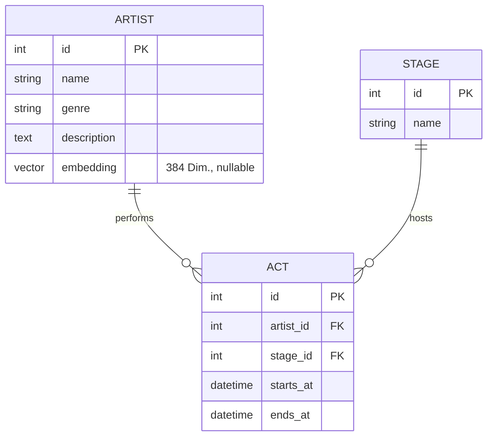

# Domain Model

Status: umgesetzt (v0.2), vereinbart am 2026-09-15, Stand 2026-09-24. Löst das bisherige
Ein-Entitäten-Modell (`ProgramItem`) ab.
**Erweiterung für die semantische Suche (Vektorsuche Phase 1, umgesetzt):** `Artist` hat seit
Roadmap-Schritt 7 zusätzlich `genre`, `description` und `embedding` (C11, B8, B9) – in Modell
und Datenbank angelegt. Seit Schritt 8 erzeugt `python -m app.embeddings` die Embeddings aus
`name`, `genre` und `description`; direkt nach dem Seed ist `embedding` leer. Seit Schritt 10
sucht `crud.search_top_artists()` darüber per pgvector; das Modell selbst ändert sich dadurch
nicht mehr.

Abgeleitet aus den Muss-Anforderungen in [`requirements.md`](requirements.md) sowie dem Ziel
von Refactoring Phase 1: `Artist`, `Stage` und `Act` als getrennte Entitäten bei unveränderter
Funktionalität. Das Modell selbst ist unabhängig von der Datenbank; seit Refactoring Phase 2
liegen die Tabellen in PostgreSQL (Neon) statt in SQLite – am Schema ändert das nichts.

## Ableitung aus den Anforderungen

| Anforderung | Bedarf am Modell |
|---|---|
| F1 – Liste (Titel, Bühne, Start, Ende) | ein `Act` referenziert genau einen `Artist` (Titel) und genau eine `Stage` (Bühne) |
| F2 / C3 – Filter nach Bühne | Filter über `Stage`; Bühnenliste ist jetzt eine echte Tabelle statt `SELECT DISTINCT` |
| F3 / C2 – „läuft jetzt" / „als Nächstes" | weiterhin rein aus `Act.starts_at` / `Act.ends_at` vs. aktueller Zeit berechnet – nichts Zusätzliches zu speichern |
| B1 – sortierte API | Sortierung über `Act.starts_at`, kein Feld nötig |
| B2 / B3 – Datenbank, Seed | drei Tabellen, die das Seed-Skript füllt (erst `Artist`/`Stage`, dann `Act`) |
| B4 – volle Zeitstempel | `Act.starts_at` / `Act.ends_at` als `datetime`, nicht nur `time` |
| C1 – kein Login | keine User-/Auth-/Favoriten-Entität |
| C4 – eine Instanz = ein Festival | „Festival" bleibt Konfiguration/Kontext, keine Entität |
| B9 – Suchinhalt | `Artist` bekommt `genre` und `description`; zusammen mit `name` sind sie der durchsuchte Text |
| C11 / B8 – semantische Suche | `Artist.embedding` speichert den Vektor zu `name` + `genre` + `description`; Bühne und Zeiten kommen über die Acts des Artists, nicht aus dem Embedding |

## Das Modell

**Drei Entitäten: `Artist`, `Stage`, `Act`**

`Act` ist der Auftritt (Zeitfenster einer Bühne); Titel und Bühnenname kommen über die
Beziehung, nicht als eigene Felder auf `Act` – das hält das Modell so klein wie möglich und
vermeidet redundante Strings.

### `Artist`

| Attribut | Typ | Pflicht | Zweck / Regel |
|---|---|---|---|
| `id` | Integer, PK, autoincrement | ja | technische Identität |
| `name` | String (nicht leer) | ja | Name des Acts, erscheint als Titel in der Liste (F1); Teil des Suchinhalts (B9) |
| `genre` | String (nicht leer) | ja | Musikrichtung in Worten, z. B. „Ambient, Downtempo"; Teil des Suchinhalts (B9) |
| `description` | Text (nicht leer) | ja | kurze Beschreibung von Stil und Stimmung, wenige Sätze; Teil des Suchinhalts (B9) |
| `embedding` | Vektor mit 384 Dimensionen (`vector(384)`, pgvector) | nein – leer, bis es erzeugt wird | aus `name`, `genre` und `description` erzeugt; Grundlage der Ähnlichkeitssuche (B8) |

`embedding` ist **abgeleitet**, keine eigenständige Fachinformation: Es wird ausschließlich aus
`name`, `genre` und `description` berechnet und nie von Hand gepflegt. Bühne, `starts_at` und
`ends_at` fließen bewusst nicht ein (siehe Scope-Abgrenzung in `requirements.md`).
Es liegt direkt auf `Artist` statt in einer eigenen Tabelle, weil es genau ein Embedding pro
Artist gibt (1:1). Eine eigene Tabelle lohnt sich erst, wenn z. B. mehrere Modelle oder
mehrere Vektoren pro Artist nötig werden.

### `Stage`

| Attribut | Typ | Pflicht | Zweck / Regel |
|---|---|---|---|
| `id` | Integer, PK, autoincrement | ja | technische Identität |
| `name` | String (nicht leer, eindeutig) | ja | Bühnenname (F1/F2) |

### `Act`

| Attribut | Typ | Pflicht | Zweck / Regel |
|---|---|---|---|
| `id` | Integer, PK, autoincrement | ja | technische Identität |
| `artist_id` | Integer, FK → `Artist.id` | ja | wer spielt (F1) |
| `stage_id` | Integer, FK → `Stage.id` | ja | wo (F1/F2) |
| `starts_at` | DateTime (Datum + Uhrzeit) | ja | Beginn (F1/F3/B1/B4) |
| `ends_at` | DateTime (Datum + Uhrzeit) | ja | Ende (F1/F3), Regel: `ends_at > starts_at` |

## ER-Diagramm

## Beziehungen

- `Artist` 1 ─ n `Act`: ein Artist kann mehrere Acts haben (z. B. mehrere Slots am Tag).
- `Stage` 1 ─ n `Act`: eine Bühne hat mehrere Acts, ein Act läuft auf genau einer Bühne.
- Keine direkte Beziehung zwischen `Artist` und `Stage`.

### Invarianten (fachlich)

- `Artist.name` und `Stage.name` sind nicht leer (auch nicht nur Leerzeichen) – zusätzlich
  DB-seitig als `CheckConstraint` erzwungen.
- `Stage.name` ist eindeutig (keine zwei Bühnen mit demselben Namen).
- `Act.ends_at` liegt echt nach `Act.starts_at` – zusätzlich DB-seitig als `CheckConstraint`
  erzwungen, nicht nur in der Business-Logik.
- Jeder `Act` hat genau einen `Artist` und genau eine `Stage` (Pflicht-FKs, kein optionaler Auftritt ohne Zuordnung).
- Zeiten werden in einer festen Festival-Zeitzone interpretiert (siehe T3 in `requirements.md`).
- Überlappungen auf derselben Bühne sind erlaubt – keine Validierung in der aktuellen Version.
- `Artist.genre` und `Artist.description` sind nicht leer (B9: „zu jedem Artist") –
  zusätzlich DB-seitig als `CheckConstraint` erzwungen.
- `Artist.embedding` passt zum aktuellen Stand von `name`, `genre` und
  `description`: Ändert sich eines der drei Felder, muss das Embedding neu erzeugt werden,
  sonst findet die Suche den Artist mit veralteten Inhalten. Alle Embeddings stammen vom
  selben Modell und haben dieselbe Dimension – Vektoren verschiedener Modelle sind nicht
  vergleichbar.

**Entschieden (Roadmap-Schritt 5 und 7):**

- Modell und Dimension: `sentence-transformers/paraphrase-multilingual-MiniLM-L12-v2`, 384
  Dimensionen. Das Modell ist mehrsprachig, deutsche Anfragen und Texte passen also (T4).
- `embedding` ist **optional** (nullable): Ein Artist kann ohne Embedding existieren, z. B.
  direkt nach dem Seed, bis die Embeddings erzeugt sind.
- Sprache von `genre`/`description`: Deutsch, wie die Suchanfragen der Besucher.

- Erzeugung (Schritt 8): separat per `python -m app.embeddings` nach dem Seed, immer für alle
  Artists. Der Embedding-Text hat ein festes Format aus `name`, `genre` und `description`,
  die Vektoren sind auf Länge 1 normiert (Details in `architecture.md`, Abschnitt "Embeddings").

**Entschieden (Roadmap-Schritt 10):**

- Die Suche überspringt Artists ohne Embedding stillschweigend (kein Fehler) –
  `crud.search_top_artists()` filtert `WHERE embedding IS NOT NULL`, bevor sie nach Ähnlichkeit
  sortiert.

## Was persistent gespeichert wird

- `Artist`-, `Stage`- und `Act`-Zeilen (drei Tabellen in der PostgreSQL-Datenbank).

## Was NICHT gespeichert / nicht modelliert wird

- „läuft jetzt" / „als Nächstes" – weiterhin zur Laufzeit berechnet, unabhängig vom Schema.
- Sortierreihenfolge – Query (`ORDER BY starts_at, stage`).
- Festival, Tag/Datum als eigene Entität, Künstlerprofil (Bilder, Links, Social Media).
- Ähnlichkeitswert eines Treffers und Embedding der Suchanfrage – beides entsteht pro Anfrage
  zur Laufzeit und wird nicht gespeichert.
- Nutzer, Sessions, Favoriten, Merkzettel (C1 – kein Login). Favoriten gibt es seit US-9,
  aber nur im Browser des Besuchers (F7), nicht in der Datenbank.

## Migration von `ProgramItem` (Hinweis für die Umsetzung)

- `ProgramItem.title` → `Artist.name` (ein `Artist` pro bisher eindeutigem Titel).
- `ProgramItem.stage` → `Stage.name` (eine `Stage` pro bisher eindeutigem Bühnennamen).
- `ProgramItem.starts_at` / `.ends_at` → unverändert auf `Act`.
- Die API-Antwort (`title`, `stage` als flache Strings im JSON) kann unverändert bleiben,
  indem die Endpunkte über die Beziehung auf `artist.name` / `stage.name` zugreifen – das ist
  eine spätere Implementierungsentscheidung (`crud.py`/`routers.py`), kein Domain-Model-Thema.

## Erweiterbarkeits-Leitplanke (nur Hinweis, keine Umsetzung)

- `starts_at` / `ends_at` als volle Zeitstempel ⇒ der Tagesfilter (F6, US-8, umgesetzt) ist
  reine Query-/Anzeige-Logik ohne Schema-Umbau: Der Tag eines Acts ist sein Starttag und wird
  zur Laufzeit abgeleitet, es gibt keine eigene Tag-Entität.
- Zusätzliche Attribute (z. B. Kapazität auf `Stage`) sind durch die Entitätstrennung ohne
  Umbau des `Act`-Schemas möglich. Die geplanten Suchfelder `genre`, `description` und
  `embedding` auf `Artist` nutzen genau diese Möglichkeit: `Act` und `Stage` bleiben
  unverändert.
